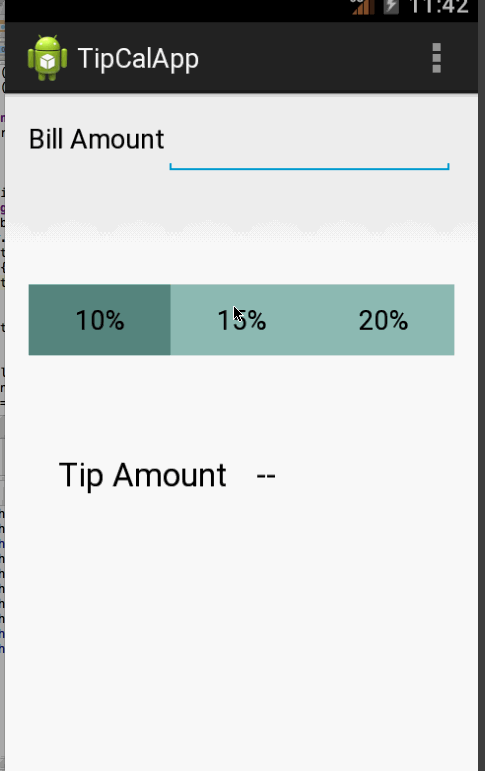

TipCalculator
====================

#week2

Time spent: 4 hours spent in total

Completed user stories:

    User is displayed the tip of specified percentage for specified entered amount - DONE

    User enters the total amount of the transaction - DONE

    User can select between tip amounts (i.e 10%, 15%, 20%) - DONE

    Upon selecting tip amount, formatted tip value is displayed - DONE

    (Optional) User changes the total amount and updated tip is reflected automatically - DONE

    (Optional) Improve the user interface and experience by using images and/or colors - DONE
 

Walkthrough of all user stories:

